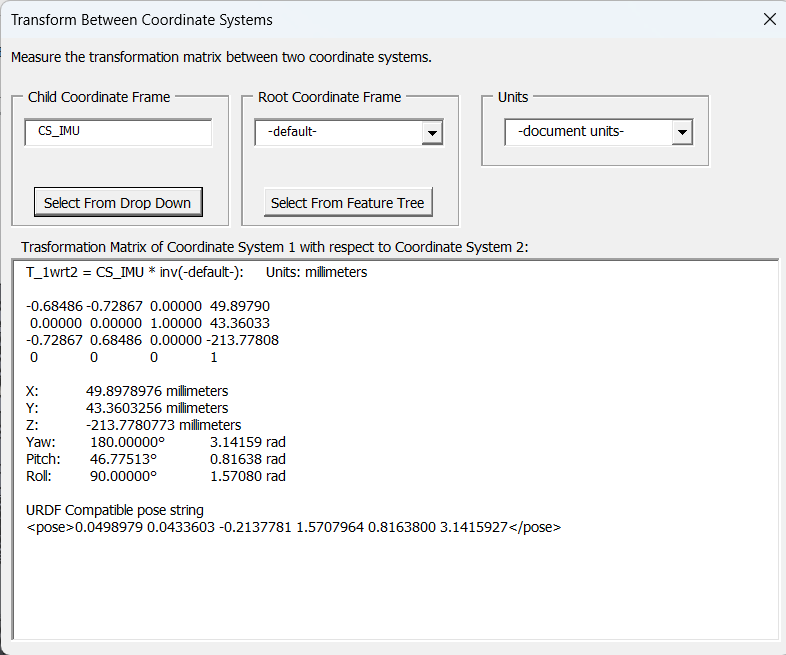

# MeasureXForm - Solidworks Macro

## Introduction

The purpose of this macro is to provide Solidworks users with a transformation matrix between coordinate systems in the feature tree, including user-defined and the default (global) coordinate system(s). The user interface is designed to make this quick and easy.

  

## Instructions

- When the user interface window appears, use the "Child Coordinate Frame" drop-down menu to choose the coordinate system (or frame) that the user desires to be the destination of the transformation matrix.
	
	- Note that only the coordinate frames in the top level of the feature tree of an assembly document are available in the drop-down menu, but by clicking the "Select From Feature Tree" button, a frame at any level can be selected by clicking on it in the feature tree. Clicking the "Select From Drop Down" allows the use of the drop-down menu once again.

- Use the "Root Coordinate Frame" drop-down menu to choose the frame that the user desires to be the source of the transformation matrix.

	- In other words, the calculated transformation matrix is the transform of Child Coordinate Frame with respect to Root Coordinate Frame.

	- Both frames are set to the document's frame (global frame) by default.
	
	- If both frames are being selected using the "Select From Feature Tree" mode, clicking inside the text box for one of the frames makes the selection apply to that frame similar to how other tools in Solidworks function.

- The "Units" drop-down menu can be used to change the units of the x/y/z translations. This is set to the document units by default.

- The desired 4x4 transformation matrix is provided in the text box at the bottom of the window. 

- The position and yaw/pitch/roll is provided in human readable formats

- An SDF compatible string for the pose is printed, this can be copy/pasted directly into a <gazebo> block inside a URDF file

## License

Copyright 2021, Aeroanion

Copyright 2023, Jesper Smith/1X Technologies

The MIT License, which is very permissive. See the LICENSE.md file for license body.
